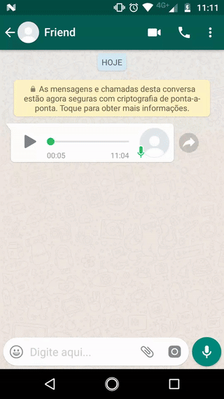

# audio-to-text-app
audio-to-text-app

 - Uses Devide Language as default
 - Allow users to choose a different language
 - Uses Bing Speech API to decode audio
 - Application receives SEND actions of audio/* and can be activated from another apps like WhatsApp

